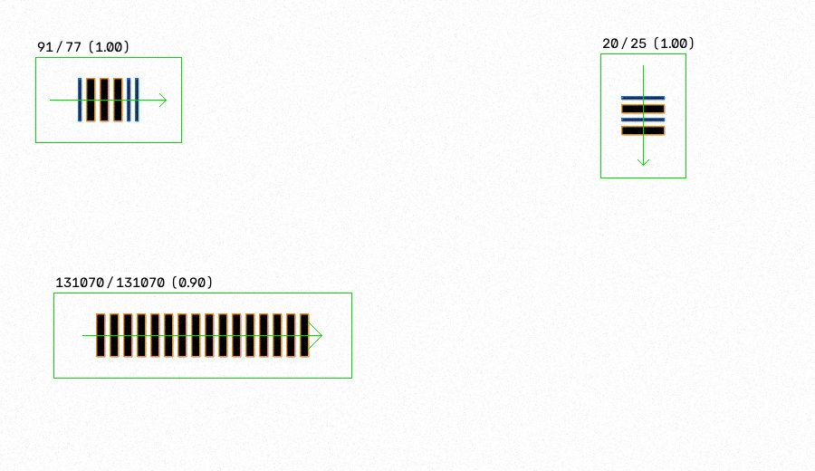

# pharmacode-toolkit

Generate, detect and decode one-track [Pharmacode](https://en.wikipedia.org/wiki/Pharmacode)
barcodes in PNG, JPEG and TIFF images. Pure Python on numpy and OpenCV.



```json
{
  "detections": [
    {"bbox": {"x": 39, "y": 63, "width": 161, "height": 94}, "orientation_deg": 0.0,
     "bars": ["narrow", "wide", "wide", "wide", "narrow", "narrow"],
     "bar_widths_px": [3, 9, 9, 9, 3, 3],
     "value": 91, "mirror_value": 77, "confidence": 1.0, "warnings": []}
  ],
  "errors": []
}
```

## What it does

- Encodes any value from 3 to 131070 into the 2..16 narrow/wide bars of the format.
- Renders synthetic codes with the Laetus physical dimensions at any DPI, with
  optional rotation, blur, noise, JPEG artefacts, contrast loss, uneven lighting,
  perspective and scaling, all seeded and reproducible.
- Finds one or more codes in an image at 0, 90, 180 and 270 degrees and small tilts.
- Classifies bars, checks quiet zones and geometry, and reports **both** reading
  directions, because the format has no start or stop pattern.
- Writes a JSON result with stable error codes and an annotated image.
- Ships a benchmark that reports a matrix of conditions, not one number.

## Install

```bash
pip install .
```

Requires Python 3.10 or newer. Runtime dependencies: numpy, opencv-python-headless.

## Quick start

```bash
pharmacode generate --value 12345 --dpi 300 --output sample.png
pharmacode decode sample.png --dpi 300
pharmacode decode sample.png --dpi 300 --json result.json --annotated result.png
```

From Python:

```python
from pharmacode import DecoderConfig, decode_image, load_image

result = decode_image(load_image("sample.png"), DecoderConfig(dpi=300))
for code in result.detections:
    print(code.value, code.mirror_value, code.confidence)
```

## Supported input

8-bit grayscale or colour PNG, JPEG and TIFF; dark bars on a light background;
codes upright, rotated by multiples of 90 degrees, or tilted a few degrees.
Pass `--dpi` whenever you know the resolution: it enables physical checks and
reliable classification of codes that use a single bar width.

## Limitations

See [docs/limitations.md](docs/limitations.md). In short: no inverted codes, no
two-track or colour Pharmacode, no DPI from file metadata, thresholds validated on
synthetic images only.

## Documentation

- [Algorithm and threshold provenance](docs/algorithm.md)
- [Command line and exit codes](docs/cli.md)
- [Benchmark](docs/benchmark.md)
- [Provenance](docs/provenance.md)

## Disclaimer

This project is an independent implementation from public descriptions of the
format. It is **not validated** for regulated pharmaceutical packaging control and
must not be used as the sole check in such a process.

## License

MIT, see [LICENSE](LICENSE).
